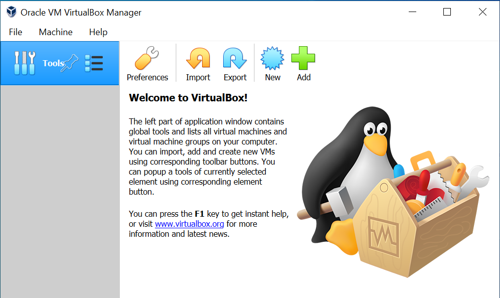
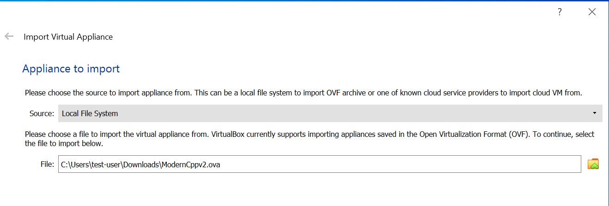
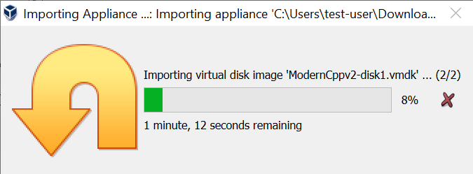

# Installing VirtualBox Image

**Prerequisite: VirtualBox installed (tested with VB v6.1 on
Windows10)**

1.  Open the link:  
    [https://www.dropbox.com/sh/w6r70h400v2lwvo/AAAUGoZZXYhXOD9j8va0z09Ka?dl=0](https://www.dropbox.com/sh/w6r70h400v2lwvo/AAAUGoZZXYhXOD9j8va0z09Ka?dl=0)

2.  Download the file **ModernCppv2.ova**

3.  This file is approximately 6GB so depending on you connect allow suitable time to download.

4.  Open VirtualBox  
    <!--  -->
    

5.  Select **Import** and open the file **ModernCppv2.ova**

<!--  -->

6.  Accept the default Appliance settings and the creation of the VirtualBox VM will proceed  
    

7.  Once imported the virtual machine (defaulted to vm) will appear - note the name of the VM can be renamed.  
    

8.  Start the Virtual Machine vm and this will now boot into Linux Mint
    <!--  -->
    

9.  Go ahead and close the notice box about Rendering.
