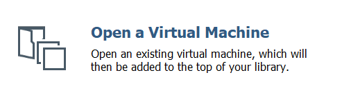
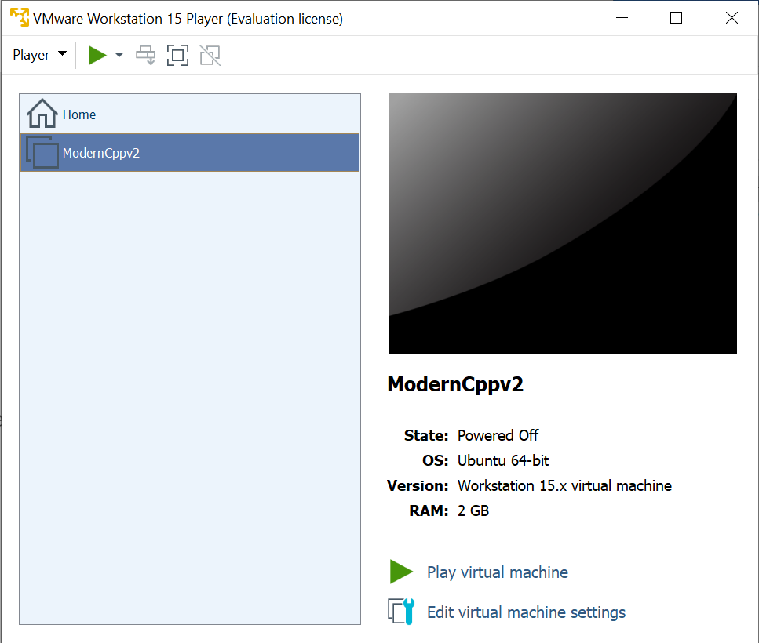

# Installing VmWare Image

**Prerequisite: VmWare Workstation 15 installed (tested on v15.5.5 on
Windows10)**

1.  Open the link:  
    [https://www.dropbox.com/sh/w6r70h400v2lwvo/AAAUGoZZXYhXOD9j8va0z09Ka?dl=0](https://www.dropbox.com/sh/w6r70h400v2lwvo/AAAUGoZZXYhXOD9j8va0z09Ka?dl=0)

2.  Download the file **ModernCppv2.ova**

3.  This file is approximately 6GB so depending on you connect allow
    suitable time to download.

4.  Open **VmWare Workstation**

5.  Select **Open a Virtual Machine**  
    
    
6.  Open this downloaded file **ModernCppv2.ova**, this will Import the VM  
    <!--  -->
    

7.  Once imported you will see **ModernCppv2** appear under Home  
    <!--  -->
    

8.  Select 'Play virtual machine', this will boot you into Linux Mint.

9.  The password for the user feabhas (and sudo) is 'mint'
   <!--  -->
   

