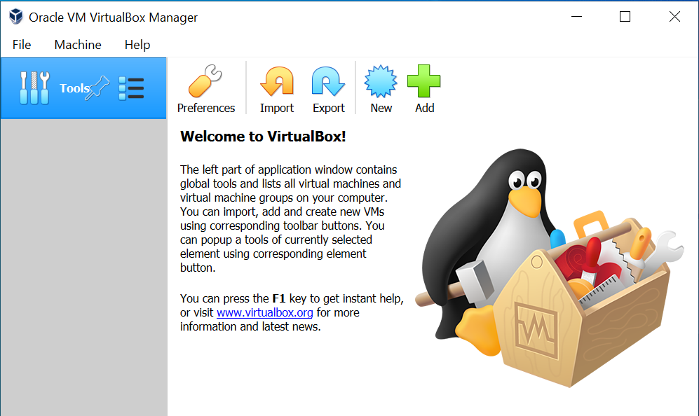
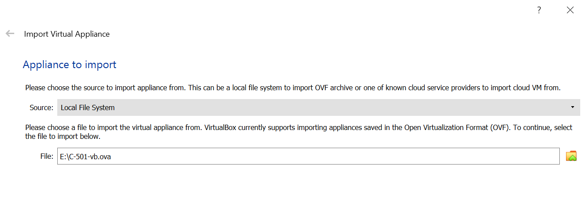
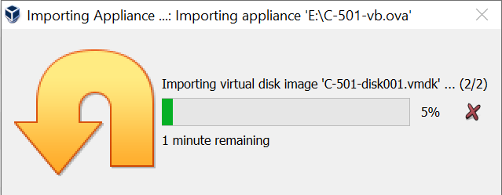
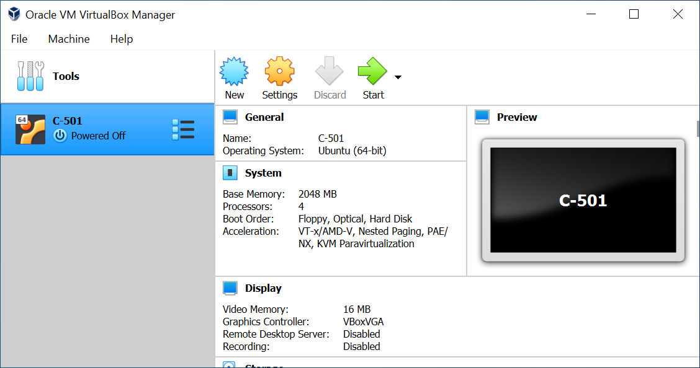
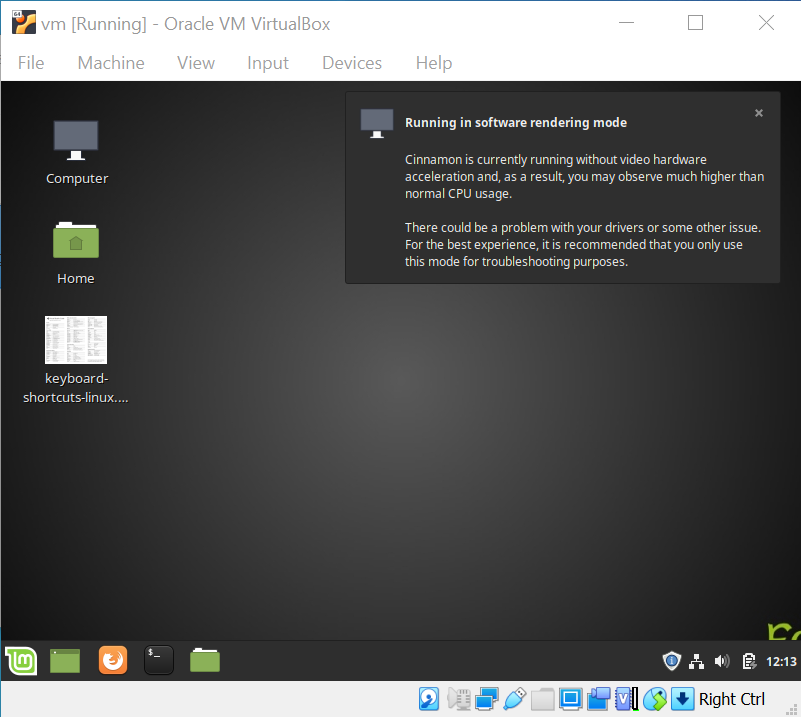

# Installing VirtualBox Image

**Prerequisite: [VirtualBox](https://www.virtualbox.org/wiki/Downloads) installed (tested using VB v6.1 on
Windows10)**

1.  Please ensure you try installing the Virtual Machine the week before the course in case you need any support.
   
2.  You will be provided with a dropbox link before the course.  
   
3.  There will typically be two files in the folder, one create from VmWare, the other from VirtualBox, e.g.
    1.  `<course-name>-vm.ova` - VmWare Image
    2.  `<course-name>-vb.ova` - VirtualBox Image

4.  Download the approiate **ova** file associated with your course and VmWare player, e.g. **C-501-vb.ova**
    
    _(In theory either file should work with both VmWare and VirtualBox as OVA is a open standard)_

4.  This file is approximately 6GB so depending on you connect allow suitable time to download.

5.  Open VirtualBox  
    <!--  -->
    

6.  Select **Import** and open the file `<course-name>-vb.ova`, e.g. `C-501-vb.ova`

<!--  -->

1.  Accept the default _Appliance settings_ and the creation of the VirtualBox VM will proceed  
    

2.  Once imported the virtual machine (sometimes it defaults to _vm_) will appear - note the name of the VM can be renamed.  
    

3.  Start the Virtual Machine vm and this will now boot into Linux Mint
    <!--  -->
    

4.  Go ahead and close the notice box about Rendering.
5.  The password for the user feabhas (and sudo) is **mint**
