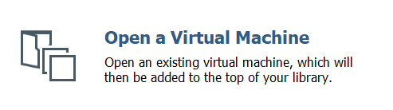
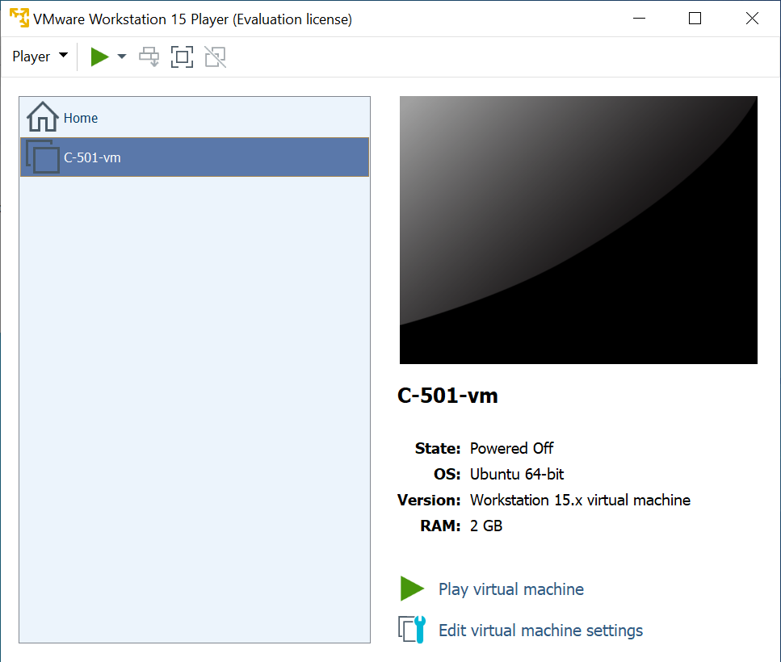
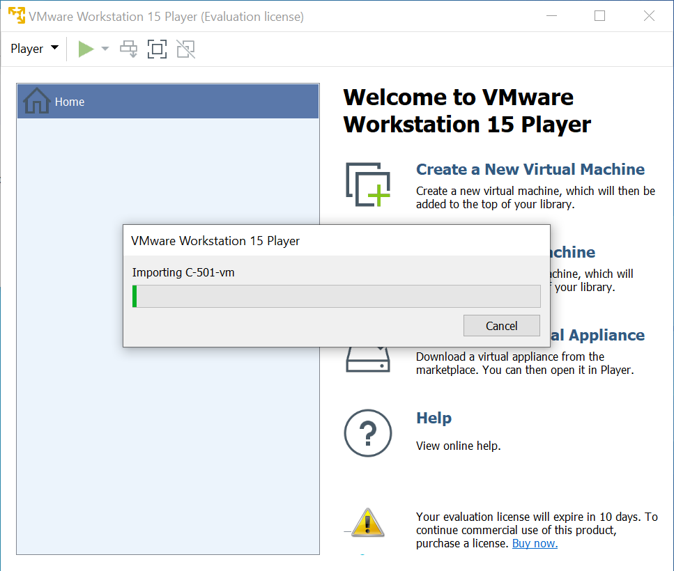
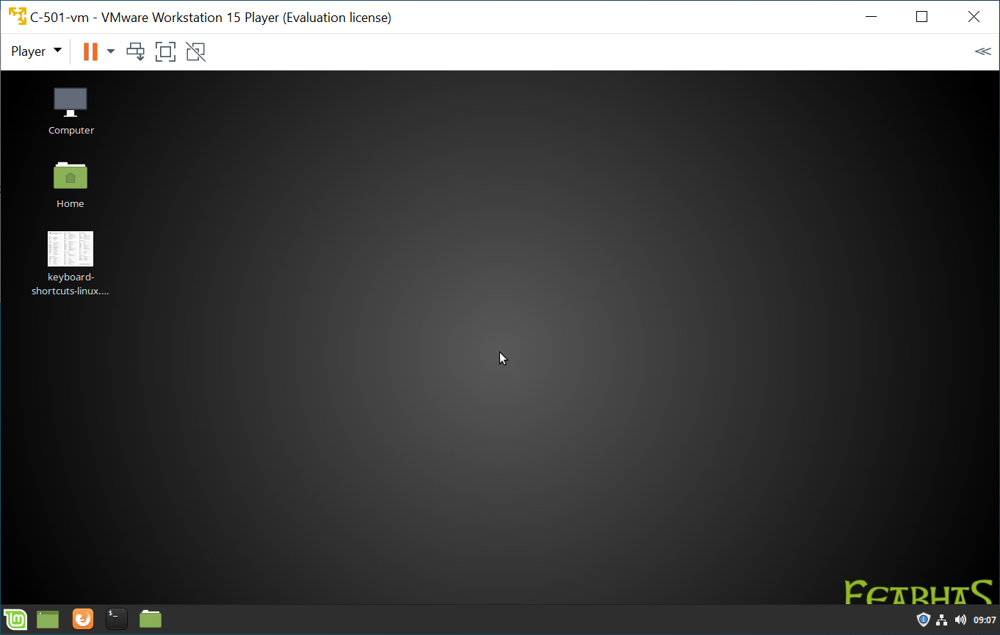
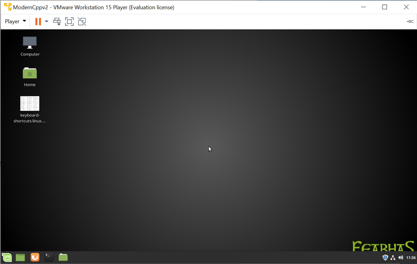

# Installing VmWare Image

**Prerequisite: [VmWare Workstation 15](https://www.vmware.com/products/workstation-player/workstation-player-evaluation.html) installed (tested using v15.5.5 on
Windows10)**

1.  Please ensure you try installing the Virtual Machine the week before the course in case you need any support.
   
2.  You will be provided with a dropbox link before the course.  
   
3.  There will typically be two files in the folder, one create from VmWare, the other from VirtualBox, e.g.
    1.  `<course-name>-vm.ova` - VmWare Image
    2.  `<course-name>-vb.ova` - VirtualBox Image

4.  Download the appropriate **ova** file associated with your course and VmWare player, e.g. **C-501-vm.ova**
    
    _(In theory either file should work with both VmWare and VirtualBox as OVA/OVF is a open standard)_

5.  This file is approximately 6GB so depending on you connection allow suitable time to download.

6.  Open **VmWare Workstation Player**

7.  Select **Open a Virtual Machine**  
    
    
8.  Open the file `<course-name>-vm.ova`, this will Import the VM  
    <!--  -->
    

9.  Once imported you will see `<course-name>` appear under Home  
    <!--  -->
    

10. Select 'Play virtual machine', this will boot you into Linux Mint.

11. The password for the user feabhas (and sudo) is **mint**
   <!--  -->
   

